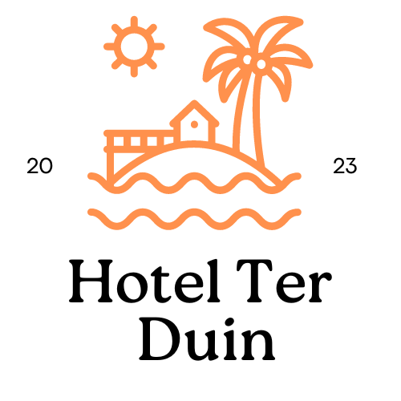

# Hotel Ter Duin - Booking Site

Hotel Ter Duin is a school project aimed at creating a booking site for a fictional hotel. This project is developed by Youssef Hoshan, Jean Carlos de la Court, Abdessamad Agalf, Patrick Agramonte, Uriech Marchena as part of ROCvA curriculum. The purpose of this project is to showcase the ability to design and implement a web application using HTML, CSS, and JavaScript.

## Table of Contents
- [Features](#features)
- [Installation](#installation)
- [Usage](#usage)
- [Technologies Used](#technologies-used)
- [Contributing](#contributing)
- [License](#license)

## Features
1. **User Registration and Login:** Users can create an account and log in to the booking site.
2. **Hotel Room Listing:** Display a list of available hotel rooms along with their details, such as room type, price, and availability.
3. **Booking:** Users can select a room and book it for a specific date range.
4. **User Profile:** Users can view and edit their profile information, including personal details and booking history.
5. **Search and Filter:** Users can search for rooms based on criteria like room type, price range, and availability.
6. **Reviews and Ratings:** Users can view and submit reviews and ratings for the hotel and rooms.
7. **Admin Panel:** An admin panel is available for hotel management, including adding new rooms and managing bookings.

## Installation
To run the Hotel Ter Duin project locally, follow these steps:

1. Clone the repository:
git clone (https://github.com/youssefhoshan/HotelTerDuin)

2. Navigate to the project directory:
cd hotel-ter-duin

3. Open the project in your preferred code editor.

## Usage
1. Set up a local development environment with a web server and a database.
2. Import the provided SQL file to set up the necessary database tables and data.
3. Configure the database connection settings in the project's configuration file.
4. Start the web server and navigate to the project in your web browser.
5. Register a new account or use the provided test account credentials.
6. Explore the available features, such as searching for rooms, making bookings, and managing user profiles.

## Technologies Used
The Hotel Ter Duin project utilizes the following technologies:

- HTML5
- CSS3
- JavaScript
- PHP
- MySQL

## Contributing
Contributions to Hotel Ter Duin are welcome! If you find any issues or have suggestions for improvement, please open an issue or submit a pull request. Make sure to follow the project's code of conduct.

## License
This project is licensed under the [MIT License](LICENSE). Feel free to modify and distribute the code as per the license terms.
